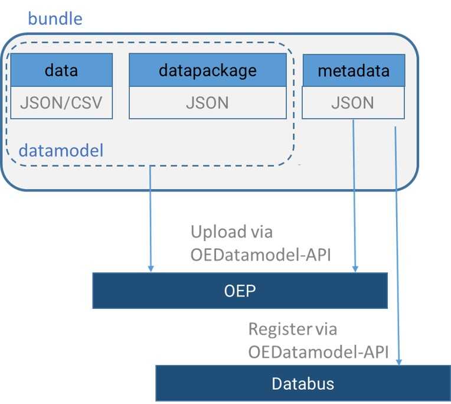

# Data architecture

In the SEDOS project data is collected, preprocessed and published by work packages (WPs) 4 to 8. 
Therefore partners working in WPs 4-8 create multiple input data bundles and upload them to the OEP.   
A data bundle consists of:

* tabular data, 
* a data structure file (generated automatically from the metadata), and 
* metadata. 

A generalized representation of a data bundle is shown in the figure below. 

These input data bundles will be automatically checked for updates and processed to one scenario data bundle by the SEDOS Data Pipeline. The scenario bundle will also be published on the OEP. 
The partners in WP9 will download the scenario bundle from the OEP and use it to set up, parameterize and solve their energy system model. The modelling results will be postprocessed and uploaded to the OEP by the partners of WP9.

# How to contribute data?

The following instructions will guide you through the process of contributing data in the SEDOS project. Hyperlinks direct you to more detailed information regarding the subject.

   
## 1. Create input data tables

- Collect and preprocess data into the tabular [oedatamodel-parameter](https://github.com/sedos-project/oedatamodel#oedatamodel-parameter) by following the [input data conventions](input_data.md#Input-data-conventions)
- Store data sources in [BIB-file](https://bwsyncandshare.kit.edu/f/2388204355) and fill Bibtex-keys in "source"-column of the data table.
- **Note** timeseries data and scalar data are stored in two different tables

## 2. Create metadata

- Create the metadata according to the [OEMetadata v.1.5.1](https://github.com/OpenEnergyPlatform/oemetadata#open-energy-family---open-energy-metadata-oemetadata) for each data table
- Use the [MetaCreator](https://meta.rl-institut.de/meta_creator/151) to create and edit your metadata (in order to edit metadata, copy metadata JSON, click on button "Edit JSON" and paste your metadata there)
- Use the [scalar meta template](https://github.com/sedos-project/oedatamodel/blob/main/extended_datamodel/datamodel_scalars.json) and the [timeseries meta template](https://github.com/sedos-project/oedatamodel/blob/main/extended_datamodel/datamodel_timeseries.json).
- Fill in as many fields as possible, but at least a minimum of the [required metadata information](metadata.md#Required-metadata-information)
- Annotate the fields 'subject', 'isAbout' and/or 'valueReference' with useful ontological concepts by applying the Open Annotation Tool (OAT). [**TODO@CM: write step-by-step guide on how to do this**]
- List all data sources in the form of Bibtex-keys under the "sources" field
- Add necessary license information to the sources according to the [licensing guide](http://127.0.0.1:8000/data_requirements/licensing/#data-licencing)

## 3. Publish bundles (data and metadata) on the OEP

The following step-by-step guide will show how to store data on the OEP and make it publicly available.
As this guide is meant for developers of AP4-8, the **Extended datamodel** will be used in the following.

todo: mit @henhuy absprechen fpr die nächsten 3 Kapitel

### Creating a table on the OEP
Once the metadata is set up, the corresponding table(s) on the OEP can be created using the [OEDatamodel API](https://modex.rl-institut.de).

### Uploading data to the OEP

### Releasing data on the databus

## 1. Create output data tables

- Collect and postprocess modelling results into the tabular [OEDatamodel](https://github.com/sedos-project/oedatamodel)) by following the output data conventions](input_data.md#Output-data-conventions)

## Glossary

| Symbol | Tool | Abbreviation | Documentation |
|--------|------|--------------|---------------|
|        |   [OpenEnergyPlatform](https://openenergy-platform.org/)   |       OEP      |               |
|        |    OEMetadata  |       OEM        |        [ docs ](https://github.com/OpenEnergyPlatform/oemetadata/blob/develop/metadata/latest/metadata_key_description.md#oemetadata---key-description)       |
|        |  OEdatamodel    |        OED      |       [ docs ](https://github.com/sedos-project/oedatamodel)      |
| | [OEdatamodel-API](https://modex.rl-institut.de/upload_datapackage/) | | [ docs ](https://modex.rl-institut.de/) |
|    :ear_of_rice:    |   OpenAnnotationTool   |       OAT       |               |
|        |   [MetaCreator](https://meta.rl-institut.de/meta_creator/151)    |              |               |
| :stars: | [databus](https://energy.databus.dbpedia.org/)  | | |
| 📙 | [Protégé](https://protege.stanford.edu/) | | [docs](http://protegeproject.github.io/protege/) |
| | | | |

In SEDOS data conventions are defined to ensure a seamless working experience.

## Summary of SEDOS conventions

1. [Data structure](input_data.md#Data-structure)
2. [Table naming](input_data.md#Table-naming)
3. [Mandatory metadata information](metadata.md#Mandatory-set-of-metadata-information)
4. [Annotation conventions for automatic data processing](data_annotation_ontoology#Annotation-conventions-for-automatic-data-processing)
