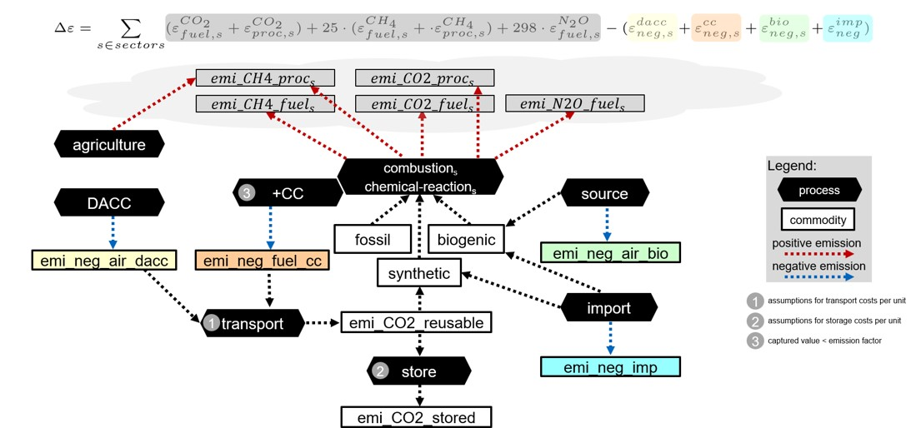

# Emissions concept

General information:

- Emission types: CO2, methane & N2O (emission values are taken from the National Inventory Report for Germany.)
- The 100-year time horizon global warming potentials (GWP) relative to CO2 according to the fourth IPCC assessment report 
  (AR4) are taken as suggested by the UWB at the time of the definition in 2023: CH4: 25, N2O: 298
- Differentiation of energy sources into fossil, synthetic and biogenic. (assumption: only carbon-capture-based synthetic imports)
- No positive balancing for electricity imports - limitation by country-specific constraints.
- Negative offsetting for imports of biogenic and synthetically produced energy sources carrying CO2
- Negative offsetting for growth of biogenic resources in Germany & for processes with CO2 capture (CC & DACC).
- No sector-specific emission targets, due to sector coupling with many possible conversions of energy sources before final energy consumption.
- Exogenous demand and carbon carrying by-products are possible, limited CO2 sinks - system boundary at product demand.
- Differentiation of emissions: Global (CO2): Foreign key mapping to the global table with emission factors per energy source.
- Process-specific (methane & N2O): Sector/process-specific emission factors due to higher dependence on process conditions
  (e.g., firing temperature N2O, material moisture CH4 ...) Direct specification with a numerical value
- Realisation of negative emissions in the model structure with the following visualized emission concept:

Summarized, this means:
  - Fossil: CO2 emissions from combustion
  - Biogen: CO2 emissions from combustion & negative emissions from production/source processes of biogenic energy sources.
  - Synthetic: CO2 emissions from combustion & model-endogenous negative emissions for import and production with carbon captured CO2.